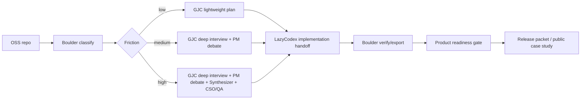

# Boulder 9.5+ Repeatable OSS Product Plan

## TL;DR

> **Summary**: Boulder can already argue a strong local Codex OSS application story, but a credible 9.5+ public OSS product needs public reproducibility: clean release state, GitHub CI, npm/tarball install smoke, externally replayable case studies, issue/security operations, and a strict claim policy. The target is a repeatable OSS CLI product/service loop, not a hosted SaaS.
> **Target Score**: 9.5+ only after public release evidence exists. Current local readiness can be treated as `9.3-9.6`; public product readiness should be treated as `8.4-8.8` until release/install/CI/external replay are proven.
> **Critical Path**: release hygiene -> public CI -> publish/install smoke -> replayable case-study harness -> support/security governance -> GJC planning to LazyCodex implementation evidence -> recalibrated final audit.

## Context

### Product Definition

Boulder is a Bun + TypeScript CLI operator kit for OSS maintainers who use Codex heavily. It turns a repository into an evidence-backed workflow through:

- friction classification
- deep interview / planning prompts
- PM debate and synthesis structure
- CSO/QA gates
- GJC planning handoff
- LazyCodex implementation handoff
- Boulder verification, export, release, and product-readiness evidence

The public product should be described as:

> Boulder is an evidence harness for OSS maintainers: it classifies work, plans through friction-aware gates, hands implementation to Codex-native executors, and blocks release claims until reproducible evidence exists.

### Current State

Evidence already present:

- CLI package name: `boulder-oss-cli`
- Core commands: `init`, `inspect`, `validate`, `verify`, `pipeline`, `scorecard`, `benchmark`, `release-plan`, `product-readiness`, `export`
- Local audit: `docs/CODEX_OSS_FINAL_AUDIT.md` reports `9.56 / 10`
- Product readiness doc: `docs/PRODUCT_READINESS.md`
- Case-study docs and evidence under `docs/CASE_STUDIES/`
- GJC/LazyCodex handoff doc: `docs/GJC_LAZYCODEX_HANDOFF.md`
- Support/security posture doc: `docs/TRUST_SUPPORT_SECURITY.md`
- Existing product plan: `plans/product-service-readiness.md`

Current 9.5 blockers:

- public release/tag/npm publish is still manual and not evidenced
- public GitHub CI evidence is not yet a hard readiness gate
- published install smoke is not yet a hard readiness gate
- dirty/untracked duplicate-looking files remain in the local tree
- external case studies are still mostly repository-local evidence
- support/security operations are documented but not fully wired into public repo templates and maintainer workflow
- GJC/LazyCodex integration is evidence-oriented, but not yet a repeatable command/schema workflow
- final audit score is local and should not be marketed as external acceptance or adoption

### Ambiguity Score

Planning ambiguity is now low-medium: `18 / 100`.

Resolved defaults:

- "Service" means repeatable OSS CLI product plus public operating loop.
- Hosted SaaS is out of scope until after npm release, public CI, and external replay proof.
- GJC plans; LazyCodex implements; Boulder gates evidence.
- Harness Manager, VoltAgent, awesome-codex-subagents, superpowers, gstack, compound, and har-maker remain references unless a later milestone promotes one through evidence.

Remaining ambiguity:

- exact public release date
- whether the first external replay uses `min9lin9/kimi-agent-swarm-skill`, Boulder itself, or another public OSS repo
- whether npm publish happens before or after Codex OSS submission

These do not block planning because the plan includes acceptance gates for each path.

## Work Objectives

### Core Objective

Move Boulder from a strong local CLI/application packet into a repeat-use public OSS product that can credibly score 9.5+ for Codex OSS support review without overclaiming hosted service, adoption, benchmark leadership, or provider runtime scale.

### Deliverables

- release-clean public repository
- GitHub Actions CI with visible green run
- package contents audit that blocks duplicate copy artifacts
- npm/tarball install smoke evidence
- public release checklist and rollback workflow
- three replayable case studies with commands, expected outputs, and evidence artifacts
- `product-readiness` gate upgraded to include public CI/install/support/replay evidence
- issue templates, security disclosure path, and support expectations
- GJC plan artifact schema and LazyCodex implementation evidence schema
- final scorecard recalibrated from local readiness to public product readiness
- Codex OSS submission packet that links claims to public artifacts

### Definition of Done

- `bun test` passes.
- `bun run ci` passes.
- package dry run excludes every `* 2.*` artifact.
- public GitHub Actions run is green and linked from the release packet.
- `bunx boulder-oss-cli --help` works after publish, or tarball install smoke works before publish.
- `boulder product-readiness --json` fails when public CI, install smoke, case-study replay, support/security, or GJC/LazyCodex evidence is missing.
- three case studies can be replayed from docs without hidden local state.
- release packet contains no claims of OpenAI acceptance, hosted availability, runtime scale, external adoption, credential access, or benchmark leadership.
- final audit separates local readiness score from public product score.

## Product Thesis

### Why This Can Reach 9.5+

Boulder should not try to beat general agent frameworks by becoming a runtime. Its strongest contribution is a Codex-heavy maintainer workflow that makes agent work inspectable, repeatable, and submission-ready:

- Codex gets a concrete OSS maintainer workflow, not a generic demo.
- Heavy users get a way to combine planning, implementation, and verification across GJC, LazyCodex, and Codex without losing evidence.
- Public maintainers get a local CLI they can run on their repos.
- The project can prove usefulness with case studies instead of unverifiable claims.

### What Would Keep It Below 9.5

- local-only evidence
- no public install smoke
- no public CI
- dirty release tree
- unclear support/security channel
- executor integration that is only prose
- scores that claim acceptance/adoption/runtime scale without proof
- adding hosted/provider runtime before the local product is stable

## Architecture Target



Boundaries:

- Boulder owns classification, evidence schema, readiness gates, export, and release packet.
- GJC owns ambiguity reduction and plan quality.
- LazyCodex owns implementation execution from an approved plan.
- Humans own release approval, npm publish, and Codex OSS submission.

## Execution Strategy

### Wave 1: Release Hygiene and Public Repo Truth

Goal: make the repository safe to publish.

Tasks:

- classify and remove or rename duplicate `* 2.*` files
- add a package contents test that fails on duplicate copy artifacts
- make `package.json` the single version authority
- ensure README, changelog, CLI output, and release docs agree on `0.1.7`
- add clean-tree expectation to release docs

Acceptance:

- `bun pm pack --dry-run --ignore-scripts` contains no duplicate copy artifacts
- `boulder --version` matches `package.json`
- `git status --short` contains only intentional release work before publish

QA:

- happy: pack dry run lists only intended package files
- failure: introduce a fixture duplicate path in test scope and confirm package audit fails

### Wave 2: Public CI and Install Smoke

Goal: move from local confidence to public reproducibility.

Tasks:

- add GitHub Actions workflow for Bun install, test, build, and pack dry run
- add CI badge to README only after the workflow exists
- add tarball install smoke for pre-publish verification
- add published install smoke for post-publish verification
- capture public CI URL in release packet

Acceptance:

- public CI run is green
- tarball install smoke works in a temp directory
- after publish, `bunx boulder-oss-cli --help` works from an empty temp directory

QA:

- happy: `bun run ci` and temp install smoke both pass
- failure: remove `bin` from package files in a branch and confirm install smoke fails

### Wave 3: Repeatable Case-Study Harness

Goal: make case studies replayable, not just written.

Tasks:

- define a case-study manifest format with repo, command, expected artifacts, and limitations
- add replay instructions for `typescript-library`, `python-package`, and `mcp-server`
- choose one real public external repo replay target
- store evidence in stable directories with command transcripts
- add a docs check that every case study links to real evidence files

Acceptance:

- at least three case studies are replayable from docs
- at least one case study references a public repo outside fixtures or clearly explains why it is still internal
- missing evidence file fails product readiness

QA:

- happy: replay all fixture case studies and regenerate expected evidence
- failure: delete one referenced evidence file and confirm readiness fails

### Wave 4: Product Readiness Gate v2

Goal: make the score honest and mechanically checkable.

Tasks:

- expand `product-readiness` checks to include public CI evidence
- add install smoke evidence check
- add support/security evidence check
- add external case-study evidence check
- split local readiness score from public product score
- make score lowering rules explicit

Acceptance:

- missing public CI evidence blocks 9.5+
- missing install smoke blocks 9.5+
- missing support/security template blocks 9.5+
- final audit cannot report one blended score without saying whether it is local or public

QA:

- happy: complete evidence returns product-ready
- failure: missing each required public evidence class returns non-zero exit and clear stderr

### Wave 5: Support, Security, and Maintainer Operations

Goal: make Boulder credible as a public OSS project.

Tasks:

- add issue templates for bug, feature, case-study report, and support request
- add security advisory/disclosure instructions
- define maintainer response expectations
- add contribution path for new case studies and readiness checks
- add rollback instructions for bad tag/npm release

Acceptance:

- a new user can find how to report a bug, security issue, and broken install
- release docs include rollback for tag and npm package states
- support/security docs are linked from README and final packet

QA:

- happy: docs link check from README to support/security pages succeeds
- failure: remove `SECURITY.md` or templates and confirm product readiness fails

### Wave 6: GJC to LazyCodex Handoff Productization

Goal: turn the executor direction into a repeatable workflow.

Tasks:

- define `gjc-plan` artifact fields: objective, friction, assumptions, tasks, acceptance criteria, QA evidence paths, unresolved risks
- define `lazycodex-result` artifact fields: changed files, tests, manual QA transcript, risk notes, release gate status
- add fixtures for low/medium/high friction handoffs
- add import or validation path for these artifacts without launching either runtime
- document exact operator flow: Boulder -> GJC -> LazyCodex -> Boulder

Acceptance:

- invalid GJC plan fixture fails validation
- missing LazyCodex implementation evidence blocks product readiness
- Boulder never requires GJC/LazyCodex installation for core commands

QA:

- happy: validate low/medium/high handoff fixtures
- failure: remove acceptance criteria from GJC fixture and confirm validation fails

### Wave 7: Benchmark and Reference Policy

Goal: keep competitive differentiation sharp without scope creep.

Tasks:

- update Harness Manager comparison with public evidence only
- define reference-only status for Harness Manager, VoltAgent, awesome-codex-subagents, superpowers, gstack, compound, and har-maker
- promote a reference to core only if it reduces user friction and has a concrete implementation task
- add "not included" reasoning to final packet

Acceptance:

- no reference project is described as an active dependency unless it is actually wired
- benchmark claims are limited to fixture behavior and documented scope
- scorecard rewards evidence quality, not feature-count inflation

QA:

- happy: benchmark report states exact fixtures and limitations
- failure: add unsupported "leader" claim and confirm docs review/checklist blocks release

### Wave 8: Public Release and Submission Packet

Goal: make the final application packet externally defensible.

Tasks:

- tag release after CI and install smoke pass
- publish npm package when maintainer approves
- create GitHub release with evidence links
- update Codex OSS application packet with public URLs
- update final audit with public product score
- add a short Korean and English "what Boulder is" summary

Acceptance:

- release packet links to GitHub repo, CI run, npm package or tarball evidence, case studies, and support/security docs
- final audit uses public evidence for 9.5+ claim
- packet includes limitations and does not claim acceptance

QA:

- happy: open every public link from the packet and confirm it resolves
- failure: unset npm/public release evidence and confirm final audit cannot claim 9.5+

## Milestones

| Milestone | Target State | Exit Gate |
| --- | --- | --- |
| M10 Release Hygiene | repo/package is publish-safe | clean tree, version sync, package audit |
| M11 Public CI | public reproducibility exists | green GitHub Actions run and README badge |
| M12 Install Smoke | users can install/run | tarball smoke and published smoke path |
| M13 Replay Evidence | case studies are repeatable | three replayable studies, one external target |
| M14 Product Gate v2 | readiness is mechanically honest | public evidence classes required |
| M15 Submission Release | Codex OSS packet is public-link backed | release packet with public URLs and limitations |

## Dependency Matrix

| Task | Depends On | Blocks |
| --- | --- | --- |
| Release hygiene | none | every public claim |
| Public CI | release hygiene | install smoke, submission packet |
| Install smoke | public CI | public product score |
| Case-study replay | release hygiene | product gate, final audit |
| Product gate v2 | CI, install smoke, replay evidence | 9.5+ score |
| Support/security ops | release hygiene | public release |
| GJC/LazyCodex schema | product gate baseline | repeatable workflow claim |
| Final packet | all prior waves | Codex OSS submission |

## Verification Strategy

Required commands for the implementing agent:

```bash
bun test
bun run ci
bun pm pack --dry-run --ignore-scripts
bun bin/boulder.ts product-readiness --json
```

Required manual QA via tmux:

```bash
tmux new-session -d -s boulder-install-smoke 'tmpdir=$(mktemp -d); cd "$tmpdir"; bunx boulder-oss-cli --help'
tmux capture-pane -pt boulder-install-smoke
tmux kill-session -t boulder-install-smoke
```

Pre-publish fallback:

```bash
bun pm pack --dry-run --ignore-scripts
# then install the generated tarball from a temp directory once the tarball path is known
```

Final readiness evidence must include:

- test transcript
- CI URL
- package dry-run output
- install smoke transcript
- product-readiness JSON
- case-study replay transcript
- support/security link check
- final audit diff

## Commit Strategy

Use small PR-sized commits:

1. `release hygiene and package audit`
2. `public ci and install smoke`
3. `case study replay harness`
4. `product readiness public gates`
5. `support security operations`
6. `gjc lazycodex handoff schemas`
7. `final codex oss release packet`

Do not merge a later commit before the earlier gate is green.

## Decision Log

- Use `boulder-oss-cli` as the package name.
- Keep `boulder` as the primary binary alias.
- Treat public OSS CLI as the product; defer hosted service.
- Treat GJC and LazyCodex as evidence handoff lanes, not required runtime dependencies.
- Score 9.5+ only when public evidence exists.
- Do not claim OpenAI acceptance, external adoption, hosted service availability, runtime scale, or benchmark leadership.

## Final Verification Wave

Before saying Boulder is a 9.5+ repeatable public OSS product:

- [ ] working tree has no accidental duplicate copy artifacts
- [ ] `bun test` passes
- [ ] `bun run ci` passes
- [ ] package dry run is clean
- [ ] public CI URL is green
- [ ] install smoke works from an empty temp directory
- [ ] three case studies replay
- [ ] GJC/LazyCodex artifacts validate
- [ ] support/security docs and templates exist
- [ ] product-readiness JSON says public product ready
- [ ] final audit score is based on public evidence
- [ ] submission packet links to public artifacts

## Go / No-Go Rule

GO for Codex OSS submission only if the final packet links to public CI, public package or tarball install evidence, replayable case studies, support/security posture, and a limitations section.

NO-GO if any 9.5+ claim depends only on local notes, private transcripts, unmerged files, unpublished package state, unavailable external repos, or unverified executor integration.
